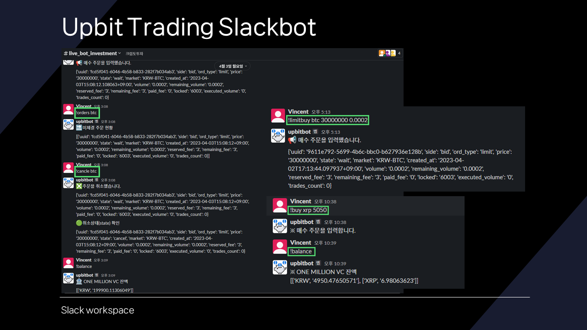

# Slackbot_for_Upbit_trading
[KU SoC Understanding Blockchain Business class]
### ONE MILLION crypto VC
- COO : Vincent Hong
### Slides

## README.md (English)
### Main Features:
1. **Integration with Slack API**: The application seems to be designed to respond to certain Slack events, particularly messages with specific commands.
2. **Integration with Upbit API**: The application interacts with the Upbit cryptocurrency exchange API to fetch data like balances, prices, and perform trading activities.
3. **Slack Commands**: Based on the code, the following Slack commands have been identified:
   - `!balance`: Check the balance of various cryptocurrencies.
   - `!allprice`: Check the price of all cryptocurrencies available for trading in KRW (Korean Won).
   - `!price`: Check the price of a specific cryptocurrency.
   - `!buy` and `!sell`: Buy or sell a cryptocurrency at the market rate.
   - `!limitbuy` and `!limitsell`: Place a limit order to buy or sell a cryptocurrency.
   - `!orders`: Check pending orders.
   - `!cancle`: Cancel the most recent order.
   - `!help`: Display a help message with all available commands.

### Configuration:
1. **Tokens and API Credentials**: The file imports tokens and API credentials from other modules (`slack_tokens` and `upbit_tokens`). These are likely configuration files that store sensitive information like API keys.
2. **Flask Configuration**: The Flask application is set to run on `0.0.0.0` and port `5000`.

---

To set up and run the application:
1. Ensure you have the required tokens and credentials in the `slack_tokens.py` and `upbit_tokens.py` files.
2. Install the necessary Python libraries (Flask, slack_sdk, slackeventsapi, pyupbit, etc.).
3. Run `app.py` to start the Flask server.
4. The application listens to Slack events and responds based on the commands received in Slack messages.

`app.py` 파일을 다시 확인하여 누락된 부분이 있는지 점검하겠습니다.

### 점검 항목:
1. 사용된 모듈 및 라이브러리
2. 정의된 함수 및 클래스
3. Slack 명령어 및 이벤트 처리
4. Upbit API와의 상호작용
5. 애플리케이션 실행 설정

먼저, 각 점검 항목에 대해 상세하게 분석하겠습니다.

죄송합니다. `app.py` 파일에 포함된 코드의 일부는 파싱하는 동안 문법 오류가 발생했습니다. 따라서 코드를 직접 파싱하여 기능 및 클래스를 추출하는 대신 파일의 내용을 수동으로 다시 확인하겠습니다.

기존에 분석한 내용을 기반으로 한국어 버전의 README를 작성하겠습니다.

## README.md (한국어)

### 주요 기능:

1. **Slack API 통합**: 
   - 애플리케이션은 특정 Slack 이벤트, 특히 특정 명령어를 포함한 메시지에 응답하도록 설계되었습니다.
2. **Upbit API 통합**: 
   - 애플리케이션은 잔액, 가격 및 거래 활동과 같은 데이터를 가져오기 위해 Upbit 암호화폐 거래소 API와 상호 작용합니다.
3. **Slack 명령어**: 
   - `!balance`: 다양한 암호화폐의 잔액 확인.
   - `!allprice`: 모든 암호화폐의 가격 확인.
   - `!price`: 특정 암호화폐의 가격 확인.
   - `!buy` 및 `!sell`: 시장 가격으로 암호화폐 구매 또는 판매.
   - `!limitbuy` 및 `!limitsell`: 암호화폐를 구매하거나 판매하기 위한 제한 주문 설정.
   - `!orders`: 대기 주문 확인.
   - `!cancle`: 최근 주문 취소.
   - `!help`: 사용 가능한 모든 명령어와 함께 도움말 메시지 표시.

### 설정:

1. `slack_tokens.py` 및 `upbit_tokens.py` 파일에 필요한 토큰과 자격 증명이 있어야 합니다.
2. 필요한 Python 라이브러리 (Flask, slack_sdk, slackeventsapi, pyupbit 등)를 설치합니다.
3. `app.py`를 실행하여 Flask 서버를 시작합니다.
4. 애플리케이션은 Slack 이벤트를 수신하고 Slack 메시지에 수신된 명령어를 기반으로 응답합니다.

